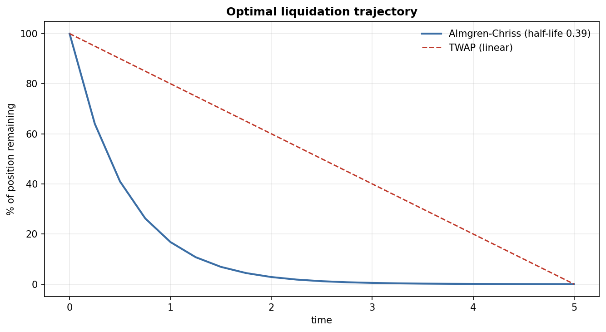
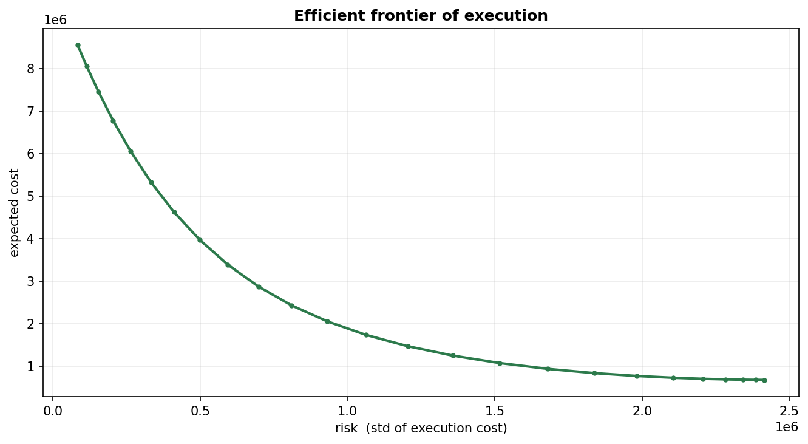

# Optimal Execution — Almgren–Chriss

Liquidate a large position the smart way. Trade too fast and you pay market impact;
too slow and price risk eats you alive. **Almgren–Chriss** makes that trade-off exact —
minimise `E[cost] + λ·Var[cost]` — and the optimal schedule comes out in closed form.



## The trade-off

On the example book (liquidate 1,000,000 units over 5 days in 20 slices):

| Schedule | Expected cost | Risk (std of cost) |
|---|--:|--:|
| **Almgren–Chriss** | 2,355,346 | 832,878 |
| TWAP (equal slices) | 681,250 | 2,484,955 |

TWAP is cheaper on impact but carries **3× the risk** — it holds inventory longer.
Almgren–Chriss front-loads the selling to cut that risk, and as risk-aversion `λ` rises
it liquidates faster still (shorter half-life). Sweeping `λ` traces the **efficient
frontier**: the best achievable cost for each level of risk.



## Method (`model.py`)

The optimal holdings decay as `x(t) = X · sinh(κ(T−t)) / sinh(κT)`, where the rate
`κ` grows with `λ·σ²/η` — more risk or more aversion ⇒ faster exit. Expected cost sums
permanent impact, the half-spread, and temporary impact `η·(rate)²`; variance is
`σ²·Σ τ·x²`. `frontier.py` sweeps `λ`; `viz.py` plots both charts.

## Real-data calibration (`data.py`)

`σ` and average daily volume are pulled from a **real Deribit instrument** so the inputs
aren't invented; temporary impact scales as `1/ADV` (deeper books cost less to trade):

```bash
uv run python scripts/run_execution.py              # example parameters (offline)
uv run python scripts/run_execution.py --calibrate  # real sigma/ADV from Deribit (BTC-PERPETUAL)
uv run pytest                                       # trajectory + frontier invariants
```

## Structure

```
optimal-execution/
├── src/execution/
│   ├── model.py      # Almgren-Chriss closed form (trajectory, cost, variance, TWAP)
│   ├── frontier.py   # efficient frontier over risk-aversion
│   ├── data.py       # calibrate sigma/ADV from real Deribit prices
│   └── viz.py        # trajectory + frontier charts
├── scripts/run_execution.py
└── tests/            # liquidates fully, beats TWAP on E+lambda*Var, faster when risk-averse
```

---

*Built by Tejas Pandya — NYU MSFE.*
