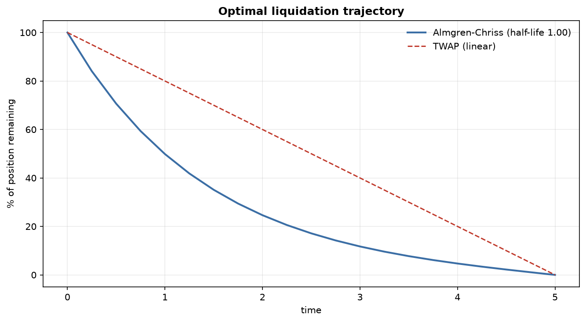
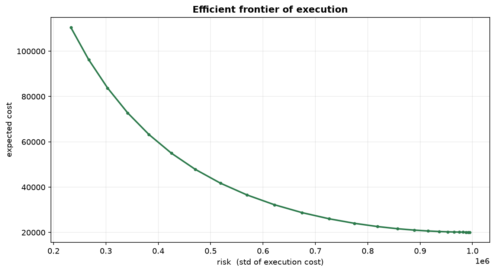
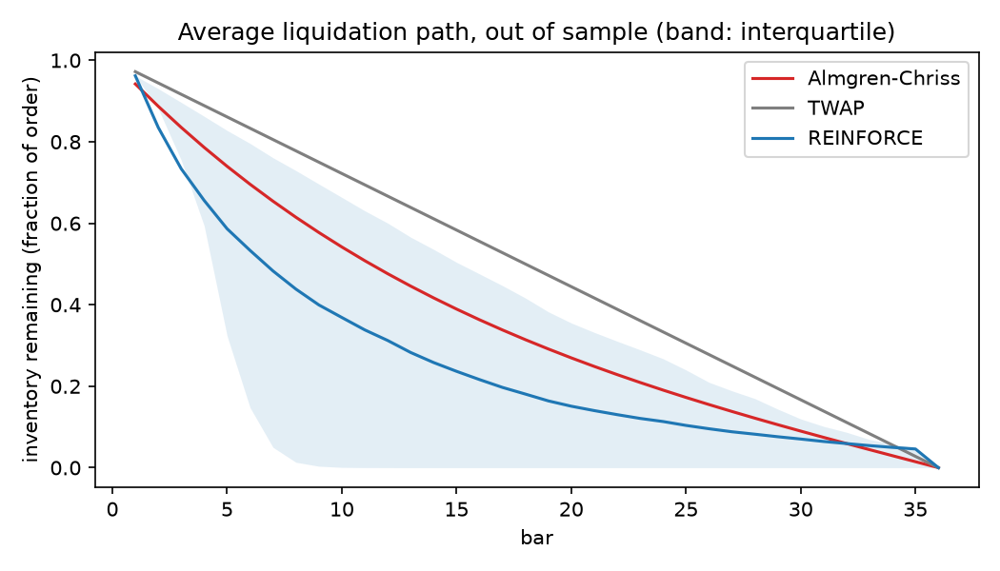
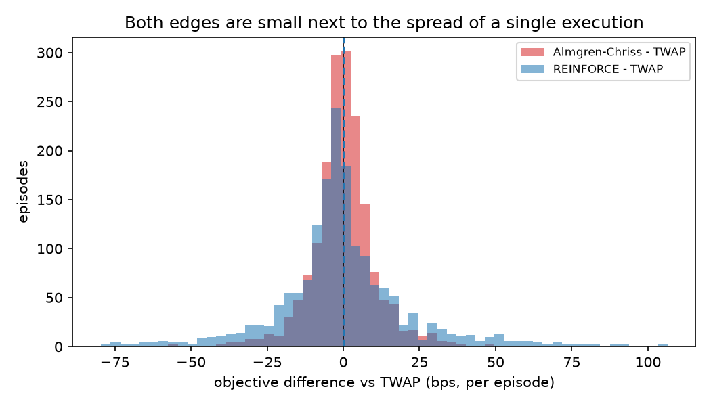
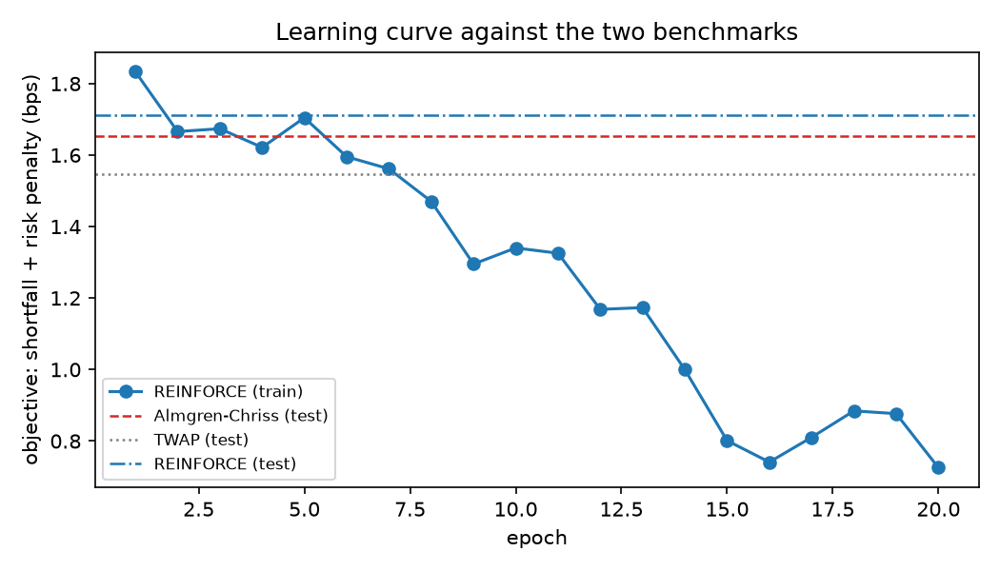

# Optimal Execution — Almgren–Chriss

Liquidate a large position the smart way. Trade too fast and you pay market impact;
too slow and price risk eats you alive. **Almgren–Chriss** makes that trade-off exact —
minimise `E[cost] + λ·Var[cost]` — and the optimal schedule comes out in closed form.



## The trade-off

Everything below is calibrated to a live Deribit book, not to chosen numbers.
BTC-PERPETUAL on 2026-09-02: price $77,019, σ $1,494/day, ADV 5,377 contracts,
touch spread $4.00. Liquidating over 5 days in 20 slices at a 1-day half-life:

| order size | schedule | cost ($) | cost (bps) | risk, std ($) |
|---|---|--:|--:|--:|
| 2% of ADV | Almgren–Chriss | 1,410 | 1.7 | 124,003 |
| ($8.3M) | TWAP | 930 | 1.1 | 199,707 |
| 10% of ADV | **Almgren–Chriss** | 32,016 | **7.7** | 620,009 |
| ($41.4M) | TWAP | 20,025 | 4.8 | 998,522 |
| 25% of ADV | Almgren–Chriss | 199,592 | 19.3 | 1,549,986 |
| ($103.5M) | TWAP | 124,648 | 12.0 | 2,496,246 |

TWAP is cheaper on impact but carries **~60% more risk** — it holds inventory longer.
Almgren–Chriss front-loads the selling to cut that risk, paying about 60% more in
impact to take roughly 38% off the standard deviation. Which of those you want is the
whole question, and sweeping urgency traces the **efficient frontier**: the best
achievable cost at each level of risk.

Two things the calibration forces you to get right, and neither is optional:

**Size the order off the book you measured.** Liquidating a hardcoded 1,000,000 units
against a 5,377-contract ADV is 186 days of volume, and a linear temporary-impact
model describes nothing at that size. Orders are specified as a participation rate.

**Impact has units.** `η = 1/ADV` carries units of 1/(contracts per day), and on a
$77,000 instrument it produced two cents of slippage per contract — 0.0 bps on a
$41M order, which is not a cost model. `η = σ/ADV` says trading one full ADV in a day
costs about one daily volatility of slippage: dimensionally consistent, and it puts a
10%-ADV order at 7.7 bps, which is a number you can argue with.



## Method (`model.py`)

The optimal holdings decay as `x(t) = X · sinh(κ(T−t)) / sinh(κT)`, where the rate
`κ` grows with `λ·σ²/η` — more risk or more aversion ⇒ faster exit. Expected cost sums
permanent impact, the half-spread, and temporary impact `η·(rate)²`; variance is
`σ²·Σ τ·x²`. `frontier.py` sweeps `λ`; `viz.py` plots both charts.

## The math

Sell $X$ shares over $[0,T]$ in $N$ slices of length $\tau$, holdings $x_k$, trade
rate $v_k = (x_{k-1}-x_k)/\tau$. Price follows an arithmetic random walk with
permanent impact $\gamma$, and each trade executes at a temporary-impact-adjusted
price $\tilde S_k = S_{k-1} - \eta v_k$ (plus half-spread $\epsilon$). Implementation
shortfall then has

$$E[C] = \tfrac{1}{2}\gamma X^2 + \epsilon X + \eta \tau \sum_k v_k^2,
\qquad
\text{Var}[C] = \sigma^2 \tau \sum_k x_k^2$$

Minimising the mean-variance objective $E[C] + \lambda \, \text{Var}[C]$ over
trajectories gives a discrete sinh solution,

$$x_j = X \, \frac{\sinh\!\big(\kappa (T - t_j)\big)}{\sinh(\kappa T)},
\qquad
\kappa^2 \approx \frac{\lambda \sigma^2}{\eta}$$

so the position decays exponentially with urgency $\kappa$: more variance penalty
($\lambda$), more volatility, or cheaper impact all mean sell faster. $\lambda \to 0$
recovers TWAP ($v$ constant); sweeping $\lambda$ traces the efficient frontier, which
is convex — its slope at any point is $-1/\lambda$.

## References

- Almgren, R. & Chriss, N. (2001), *Optimal Execution of Portfolio Transactions*, Journal of Risk 3(2).
- Bertsimas, D. & Lo, A. (1998), *Optimal Control of Execution Costs*, Journal of Financial Markets 1(1).
- Gatheral, J. (2010), *No-Dynamic-Arbitrage and Market Impact*, Quantitative Finance 10(7) — why impact functions can't be arbitrary.

- Corwin, S. & Schultz, P. (2012), *A Simple Way to Estimate Bid-Ask Spreads from Daily High and Low Prices*, Journal of Finance 67(2).
- Williams, R. (1992), *Simple Statistical Gradient-Following Algorithms for Connectionist Reinforcement Learning*, Machine Learning 8 — REINFORCE, and the baseline argument.
- Nevmyvaka, Y., Feng, Y. & Kearns, M. (2006), *Reinforcement Learning for Optimized Trade Execution*, ICML.

## Real-data calibration (`data.py`)

`σ`, average daily volume and the live touch spread are pulled from a **real Deribit
instrument**, and this is the default path — there is no invented book to fall back to
unless you ask for one. Temporary impact scales as `σ/ADV`; `ε` is half the quoted
spread, which used to be hardcoded at 0.0625, a US equity tick from before
decimalisation.

Urgency is specified as a **half-life in days** rather than as `λ`. `λ` divides through
by `σ²` and `η̃`, so it carries the instrument's price and volume units: the old default
of `2e-6` was reasonable on a made-up book and puts the half-life at 0.02 days on a real
BTC calibration, i.e. liquidate immediately. A half-life is the same number whatever you
are trading.

```bash
uv run python scripts/run_execution.py                     # real Deribit calibration
uv run python scripts/run_execution.py --participation 0.25 --half-life 0.5
uv run python scripts/run_execution.py --offline           # illustrative, no network
uv run pytest                                              # trajectory + frontier invariants
```

## Does a learned policy beat the closed form? (`rl.py`, `env.py`)

The closed form is optimal under its own assumptions: arithmetic Brownian price, linear
impact, no signal. Real books violate all three. So put a policy-gradient agent on real
bars, give it the same objective, and see what it finds.

**The data.** 207,361 five-minute BTC-PERPETUAL bars from Deribit, 2024-09-13 to
2026-09-03, pulled by `bars.py` and cached to `data/bars/`. The chart endpoint caps a
response at 5,001 bars and does not say so — it returns a shorter series with
`status: ok` — so a single call for two years quietly covers seventeen days. The fetcher
walks backwards in chunks.

Those bars cut into **5,752 non-overlapping three-hour episodes** (36 bars). Non-overlapping
because overlapping windows share most of a price path, and an agent graded on them is
being graded on data it trained on. Each episode liquidates 10% of the preceding window's
volume — a median order of 81 contracts, about $7.0M.

**Calibration uses only bars that closed before the episode opens.** σ from the prior
288 bars, volume likewise, and the half-spread from the Corwin–Schultz high–low estimator
over the same lookback. A test enforces it: multiply every bar from the episode's first
onwards by three and every parameter must come back identical.

**The split is chronological, 70/30.** A random split would put a day's afternoon in
training and its morning in test, and BTC's own autocorrelation would do the rest.

| out of sample, 1,726 episodes | shortfall | risk penalty | objective | per-episode σ |
|---|--:|--:|--:|--:|
| TWAP | 1.499 | 0.047 | **1.546** | 49.2 |
| Almgren–Chriss | 1.623 | 0.030 | 1.653 | 39.8 |
| REINFORCE | 1.686 | 0.026 | 1.713 | **33.8** |

*(basis points of order notional; the objective is shortfall + λ·risk, the same one the
closed form minimises, so all three are graded by identical arithmetic)*



**The agent rediscovers Almgren–Chriss.** It was never shown the closed form, only real
prices and a cost function, and it converged to a path with the same convex shape and a
risk-adjusted cost 0.060 bps away — paired t of 0.10 across 1,726 out-of-sample episodes.
That is not "close to"; it is statistically the same number.

**Nothing beats TWAP, including the closed form.** Almgren–Chriss costs 0.107 bps more
than equal slices out of sample, t = 0.38, and wins in 50.5% of episodes. A coin flip. The
theory's edge over TWAP is real but it is 0.6% of the cost, and a single execution's outcome
has a standard deviation of 49 bps. You are trying to hear one part in five hundred.



**What the agent does win is dispersion.** 33.8 bps against TWAP's 49.2, a 31% reduction,
for 0.167 bps of mean cost. Front-loading is worth paying for, and it is the same reason
Almgren–Chriss front-loads; the agent just found it by trial.

### The control variate is what made it trainable

Almost all of an execution's realised cost is where the price went, and that part is common
to every schedule facing the same path. Subtracting the TWAP schedule's cost *on the
identical path* removes it, and cannot bias the gradient because the agent's action cannot
move it.

| REINFORCE, 20 epochs | objective (test) | risk penalty |
|---|--:|--:|
| trained on raw shortfall | 1.993 | 0.007 |
| trained on the TWAP-differenced reward | **1.713** | 0.026 |

Without it the agent gives up and dumps the inventory in the first few bars — a risk penalty
of 0.007 bps is the signature of holding nothing. The gradient it was being asked to follow
was a tenth of a basis point buried under eighty.



The train/test gap in the table is not overfitting: the two benchmarks that learn nothing
moved by 1.1 bps between the two periods as well. The second year was simply more expensive
to trade. Having non-learning controls in the same table is the only reason that is visible.

### Where this is soft

The half-spread comes from Corwin–Schultz, which puts the median at 3.0 bps while
BTC-PERPETUAL's live touch spread is 0.06 bps. The estimator reads intra-bar range as
spread and overstates it badly on a tight, volatile instrument. It survives here only
because every schedule liquidates the full order, so the spread term is ε·X for all three
and cancels out of every comparison in this section. It would not survive a question about
the *level* of cost, and Deribit's public history carries no quotes to fix it with.

The gradients are hand-derived rather than autodiffed, and are checked against central
differences in `tests/test_execution.py`.

```bash
uv run python scripts/train_rl_execution.py
uv run python scripts/train_rl_execution.py --no-control-variate   # the ablation above
```

## Structure

```
optimal-execution/
├── src/execution/
│   ├── model.py      # Almgren-Chriss closed form (trajectory, cost, variance, TWAP)
│   ├── frontier.py   # efficient frontier over risk-aversion
│   ├── data.py       # calibrate sigma/ADV from real Deribit prices
│   ├── bars.py       # paginated intraday bar history, cached to data/bars/
│   ├── env.py        # one liquidation episode on a real price path
│   ├── rl.py         # Gaussian-policy REINFORCE, gradients written out in numpy
│   └── viz.py        # trajectory, frontier, learning curve, holdings, cost gap
├── scripts/
│   ├── run_execution.py        # closed form + efficient frontier
│   └── train_rl_execution.py   # train the agent, grade it against AC and TWAP
├── data/bars/        # cached real bars (207,361 five-minute BTC-PERPETUAL)
└── tests/            # 18 checks: no look-ahead, hand-derived gradients vs finite differences
```

---

*Built by Tejas Pandya — NYU MSFE.*
